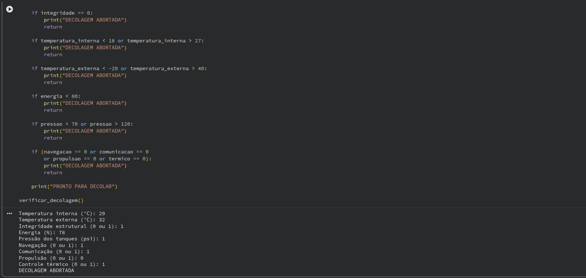
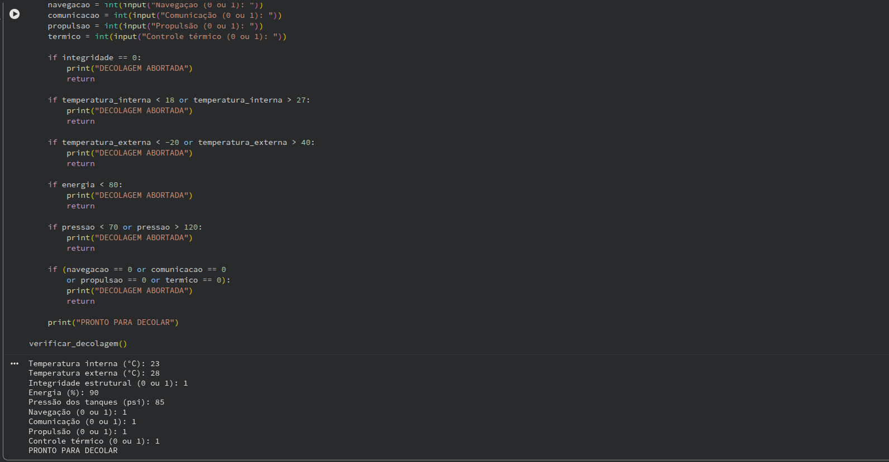

# Sistema de Verificação de Decolagem – Telemetria

## Explicação do Projeto

Este projeto simula um sistema de verificação de telemetria utilizado antes da decolagem de uma nave espacial. O sistema analisa diferentes parâmetros críticos para verificar se todas as condições estão dentro das faixas de segurança estabelecidas.

Dados analisados:

* Temperatura interna e externa
* Integridade estrutural
* Nível de energia da nave
* Pressão dos tanques
* Status dos módulos críticos (navegação, comunicação, propulsão e controle térmico)

Com base nessas informações, o programa determina automaticamente se a nave está **PRONTA PARA DECOLAR** ou se a **DECOLAGEM SERÁ ABORTADA**.

---

## Instruções de Execução do Código

1. Abra o arquivo `telemetria_decolagem.ipynb` no **Google Colab** ou em um **Jupyter Notebook**.

2. Execute a célula de código.

3. Insira os valores solicitados pelo programa:

   * temperatura interna
   * temperatura externa
   * integridade estrutural
   * nível de energia
   * pressão dos tanques
   * status dos módulos críticos(navegação, comunicação, propulsão e térmico)

4. Após inserir os dados, o programa irá analisar os parâmetros e mostrar o resultado final no terminal.

O resultado poderá ser:

```
PRONTO PARA DECOLAR
```

ou

```
DECOLAGEM ABORTADA
```

---

## Prints da Execução

Exemplo de execução do código:



Exemplo de entrada de dados:

```
Temperatura interna: 23
Temperatura externa: 28
Integridade estrutural: 1
Energia: 90
Pressão dos tanques: 85
Navegação: 1
Comunicação: 1
Propulsão: 1
Controle térmico: 1
```

Resultado do programa:

```
PRONTO PARA DECOLAR
```



---

## Autor

Arthur Morais
Projeto desenvolvido para atividade acadêmica da FIAP.
